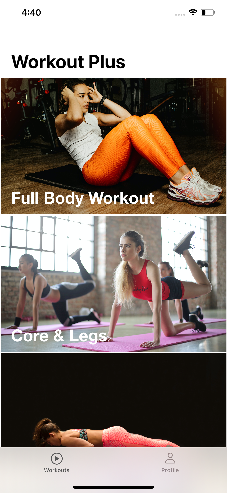

# Workout Plus

Fitness app for iOS for building and tracking your own workouts 

(If you're reading this, this app is still a __work in progress__)

Features include: 
- Save data persistently with CoreData
- Track calories burned after each workout
- View Youtube tutorials for each exercise in a WebKit page
- Personalized user profile

TODO
- Add an option to let users save their own workout routine

# Screenshots
Main View | Exercise Details | User Profile Stats | Tutorials Page 
------------ | -------------  | ------------- | ------------- 
 |  | | 

### Acknowledgements
Images provided by Unsplash: https://unsplash.com/

Icons by Icons8 https://icons8.com 
